class: center, middle

## 비개발자를 위한 Git 과 GitHub
### Hugo Kim

---

## 버전 관리?

* 협업으로 문서를 만들때 누구나 흔히 겪는 상황
  * `발표자료-20160120`
  * `발표자료-최종`
  * `발표자료-최종 수정 1`
  * `발표자료-최종 수정 2`
  * `발표자료-진짜 최종`
  * `발표자료-진짜 마지막 수정`
* 변화를 추적하는 것은 원래 어렵다

---

## 버전 관리 시스템

* 파일의 변화를 저장하고 추적할 수 있게 해 주는 일종의 데이터베이스
* 필요할 경우 예전 버전으로 돌려놓을 수도 있어야
* 쉽게 접할 수 있는 간단한 버전 관리 시스템
  * Google Drive
  * 위키백과

---

## Google Drive 의 예

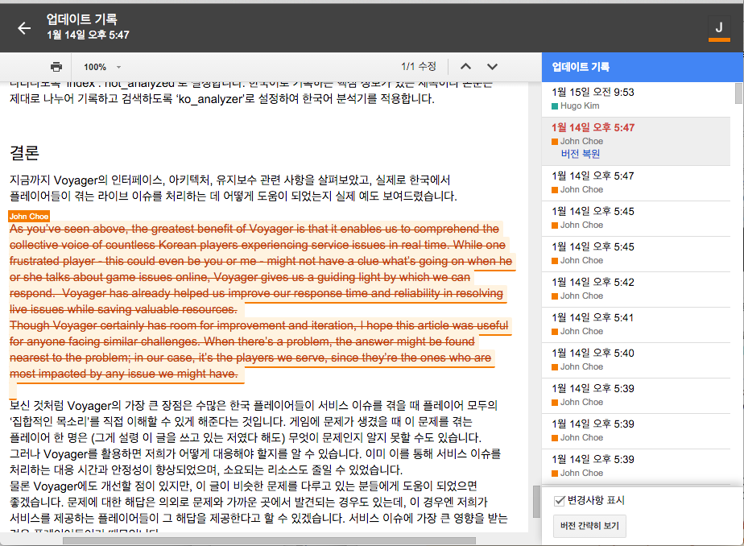

---

## Git

* [git-scm.com](http://git-scm.com/)
* 리눅스 개발자 리누스 토르발스가 만든 버전 관리 시스템
* 기존의 버전 관리 시스템들이 무료는 너무 구리고 유료는 라이센스 문제로 리눅스에 사용할 수
  없어 한달만에 직접 짰다고…
* 2005년에 처음 발표한 후 10년만에 세계에서 가장 많이 쓰이는 버전 관리 시스템이 되었음
* 개인적인 의견으로는 컴공과에서 가르치지 않는 기술 중에 개발자에게 가장 유용한 기술입니다

---

## GitHub

* [www.github.com](https://www.github.com)
* Git 버전 관리 시스템을 웹으로 관리할 수 있게 해주는 서비스
* 전세계 개발자들이 가장 많이 쓰는 협업 도구
* 라이엇게임즈는 GitHub 엔터프라이즈 버전을 사용합니다
* [gh.riotgames.com](https://gh.riotgames.com)

---

## SourceTree

* [www.sourcetreeapp.com](https://www.sourcetreeapp.com)
* 많이 쓰이는 GUI 기반 Git 관리 툴
* 무료입니다!

---

## GitHub 저장소를 만들어 봅시다

GitHub 계정을 만들고 New repository 를 클릭

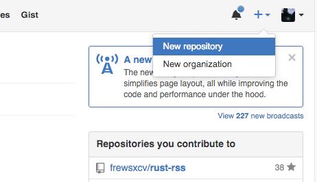

이름과 설명을 적고 Create Repository 버튼을 누르면 끝

---

## 저장소를 내 컴퓨터로 가져오기

모든 저장소에는 고유의 URL 이 생성됩니다

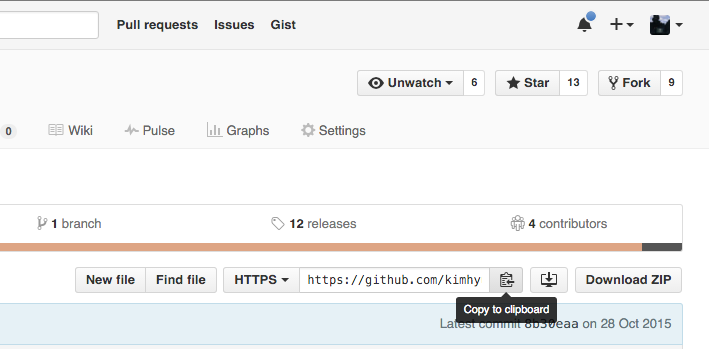

---

## 저장소를 내 컴퓨터로 가져오기

이 저장소의 URL 을 복사하여 내 컴퓨터의 GUI 클라이언트에서 가져오면 저장소를 복제할 수
있습니다

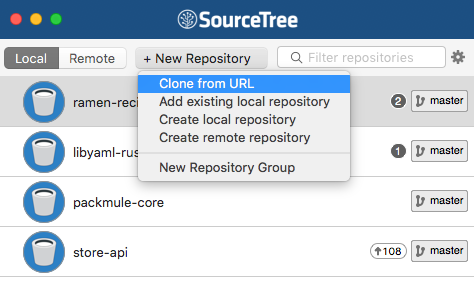

---

## 커밋 Commit

* 파일에 가하는 모든 변화 (새 파일 만들기, 고치기, 옮기기, 지우기) 를 "커밋"으로 만들어
  저장소에 저장할 수 있습니다
* 보통 여러 파일에 대한 편집을 하나의 논리적인 묶음으로 묶어 커밋할 것을 권장합니다
  * 왜? 필요할 경우 되돌릴 수 있는 논리적인 단위가 되는 것이 좋으니까요

---

## 커밋 해보기

* 아무 파일이나 메모장으로 열어 새로 생성하거나 고쳐 봅니다
* 커밋할 파일을 선택합니다
* 커밋 메시지를 작성한 후 커밋 버튼을 누릅니다

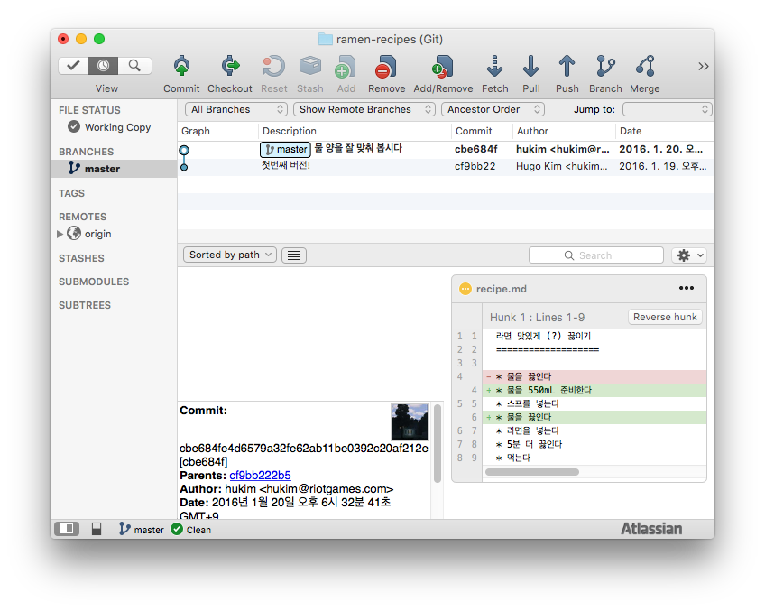

---

## Push

* 내 컴퓨터에서 만든 커밋을 GitHub 에 있는 원본 저장소로 올립니다
* 단순히 현재 상태만 올라가는 것이 아니라 모든 커밋 히스토리가 함께 올라갑니다

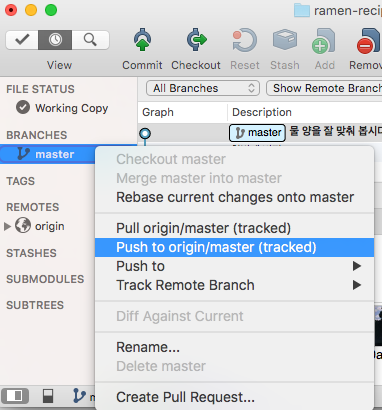

---

## Pull

* 원본 저장소에 있는 커밋을 내 컴퓨터의 저장소로 가져옵니다
* Push 와 마찬가지로 모든 커밋 히스토리가 함께 따라옵니다

---

## 원본 저장소와 내 저장소의 히스토리가 다를 때?

* 히스토리가 다를 때 push 를 시도할 경우 push 에 실패합니다

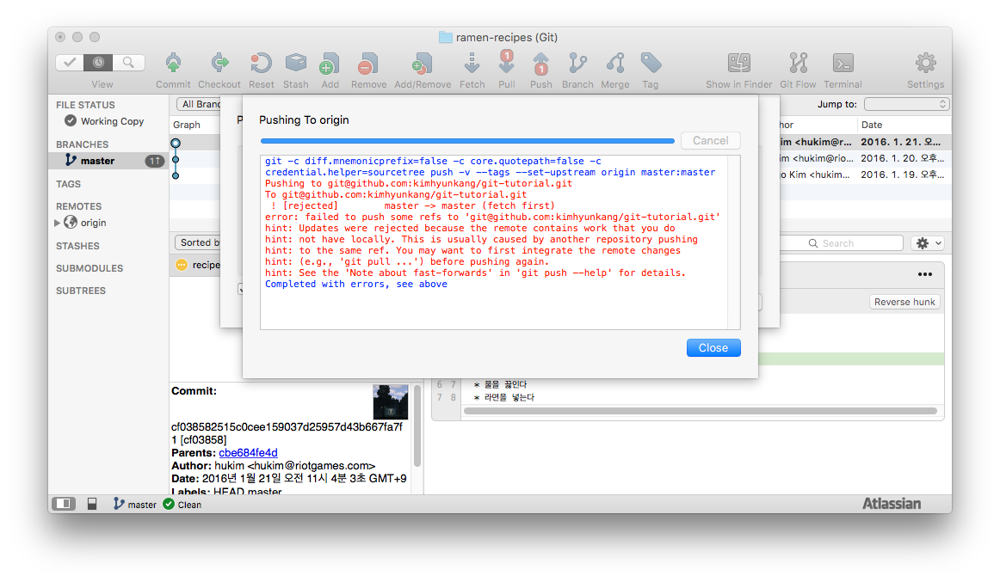

---

## 원본 저장소와 내 저장소의 히스토리가 다를 때?

이때는 먼저 pull 을 하여 서로 다른 히스토리를 병합 (merge) 합니다

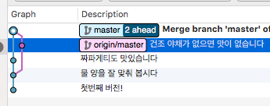

서로 다른 변경이 둘다 잘 적용된 것을 확인한 후 다시 push 합니다

---

## 병합이 중요한 이유

* 개발이 이렇게 이루어진다면?
  * `5.23_상점_버그_패치.zip`
  * `5.23_나만의_상점_기능_추가.zip`
  * `5.23_일라오이_챔프_추가.zip`
  * `5.23_로컬_스트링_버그_수정.zip`
* 버전 관리 시스템이 없다면 이 변화들을 어떻게 하나의 릴리즈로 묶을 수 있을까요?
  * 버전 관리 시스템은 프로그래머의 가장 중요한 협업 도구입니다
  * 펀치카드로 프로그래밍하던 1960년대에도 이미 기초적인 버전 관리 시스템은 존재했습니다

---

## Fork: 다른 사람의 저장소를 복제하기

* GitHub 에 있는 다른 사람의 저장소를 복제하여 내 걸로 가질 수 있습니다
* Clone 과 똑같이 모든 커밋 히스토리가 함께 복사됩니다

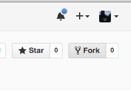

---

## Pull Request: 코드 병합 요청

* 먼저 내 Fork 에 나만의 커밋을 Push 합니다
* `New pull request` 버튼을 눌러 병합을 요청합니다

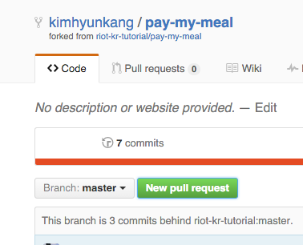

---

## Pull Request: 병합하기

* 원본 저장소의 개발자는 커밋 내용을 리뷰합니다 (코드 리뷰는 중요합니다!)
* 적절한 내용이라고 판단되면 `Merge pull request` 버튼을 누릅니다

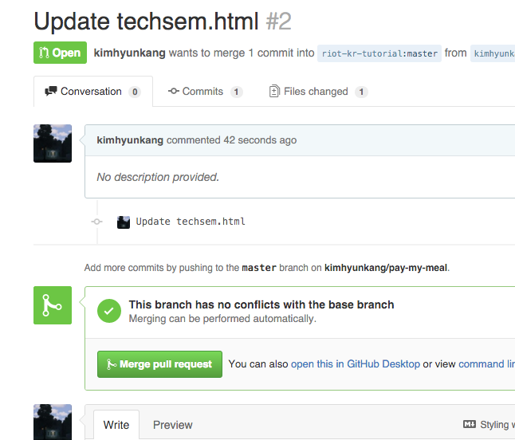
